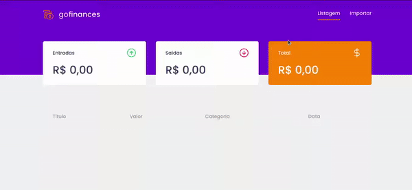
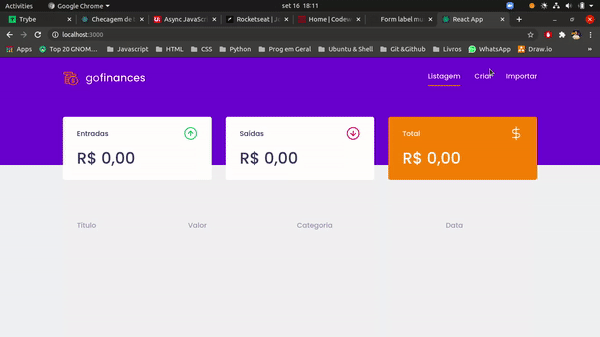

# GOFinance!

Here you have a simple React Application build to add/remove financial transactions and have a Dashboard for checking the current account status.

This project uses concepts from:

* React
* Styled Components
* Node JS
* Repositories
* SQL (Postgres)
* Express
* ESlint
* ORM queries and interactions
* Routing
* Single Page Application (SPA)
* Error Handling
* Middleware
* SOLID architecture
* Responsivity

## Preview

Check out 2 gifs of the application:

